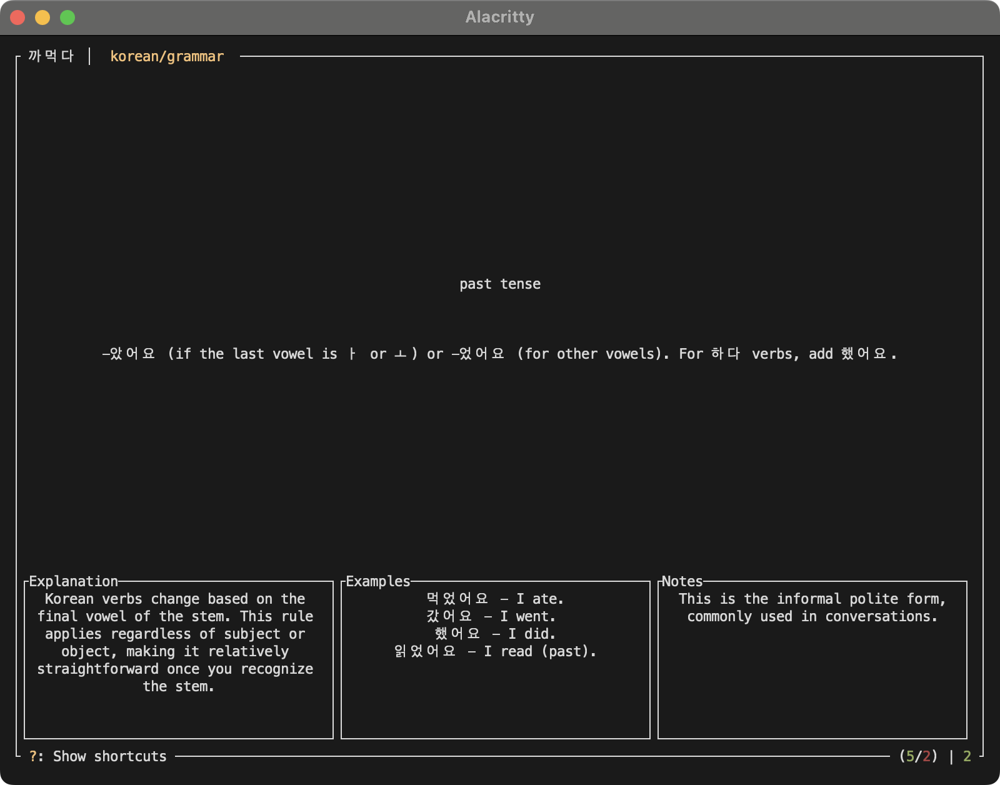

# kkameokda (Flashcard TUI)

A terminal-based flashcard application, featuring spaced repetition and a clean, intuitive interface.



## Features

- Terminal-based user interface with keyboard controls
- Spaced repetition system for efficient learning
- Local first: you keep your flashcards on your filesystem
- Support for hierarchical deck organization
- Reversible cards for bilateral learning
- Rich card content including examples, explanations, and notes
- YAML-based card format for easy editing
- Session statistics tracking

## Installation

1. Ensure you have Rust installed on your system
2. Clone this repository
3. Build the project:
```bash
cargo build --release
```
4. The binary will be available in `target/release`

## Usage

By default, the application looks for flashcards in `~/flashcards/`. If you would like to store your flashcards elsewhere, you can specify a different directory using the `--directory` flag:

```bash
kkameokda --directory /path/to/flashcards
```

## Directory Structure

Flashcards are organized in directories, where each directory represents a deck:

```
~/flashcards/
  ├── Korean/
  │   ├── hello.yaml
  │   ├── frog.yaml
  │   └── grammar/
  │       └── past_tense.yaml
  └── Chinese/
  │   └── simplified/
  │       └── ten.yaml
  │   └── traditional/
  │       └── horse.yaml
```

## Card Format

Cards are stored as YAML files with the following structure:

```yaml
front: "Front of the card"
back: "Back of the card"
notes: "Optional notes"
examples:
  - sentence: "Example sentence"
    translation: "Translation of example"
explanation: "Optional explanation"
reversible: true  # Optional, defaults to true
```

The only mandatory fields are `front` and `back`, so a simple card could be:

```yaml
front: 안녕
back: hi/bye
```

### Command Line Options

- `-d, --directory`: Specify custom flashcards directory
- `-r, --reversible`: Enable/disable reversible cards (defaults to true)

### Keyboard Controls

- `Space`: Toggle between front and back of card
- `Enter`: Mark current card as remembered
- `f`: Mark current card as forgotten
- `q`: Quit the application
- `?`: Show keyboard shortcuts
- `Ctrl+e`: Open current flashcard in default editor
- `Esc`: Close shortcuts popup
